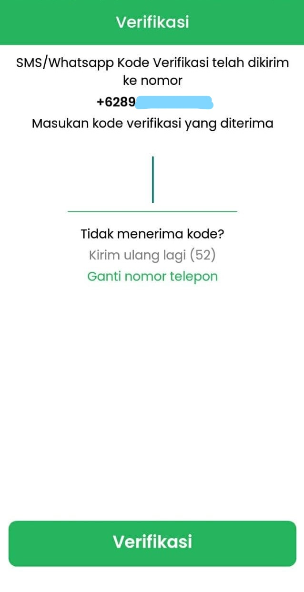

# Daftar Akun Warga Biasa

Jika desa belum menjadi desa Mitra Digides, warga tetap bisa menggunakan Aplikasi Digides menggunakan Akun Warga Biasa.

1. Pada bagian Tab Akun pilih akan muncul halaman berikut, klik tombol "Tidak". 

2. Halaman login akan muncul, klik "Buat akun". 

3. Isi semua _field_ dengan baik dan benar, lalu klik "Buat Akun". 

4. Halaman verifikasi OTP akan muncul, dan kode OTP akan dikirim melalui SMS/Whatsapp, masukan kode OTP yang diterima dan klik "Verifikasi". 

5. Jika nomor telepon yang dimasukan sebelumnya salah, nomor bisa diganti dengan klik "Ganti nomor telepon" lalu isikan nomor telepon yang ingin digunakan.
