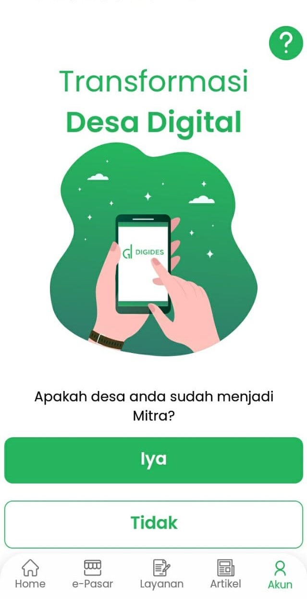
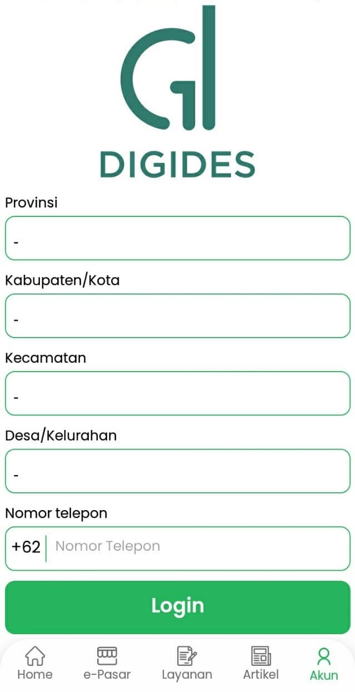
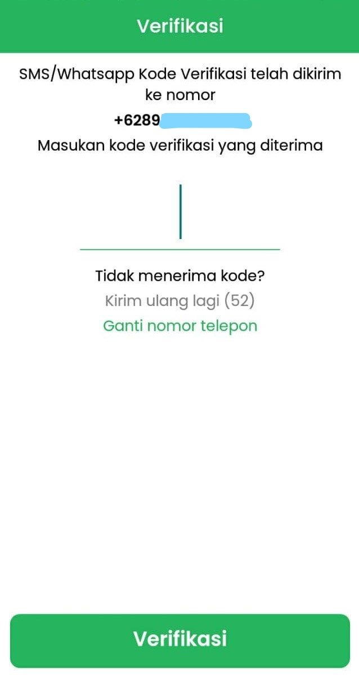
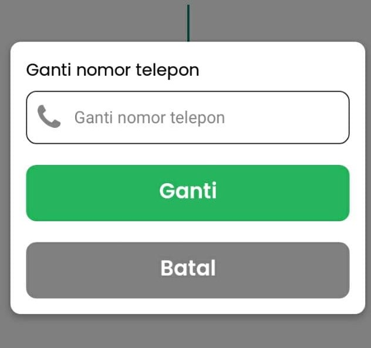

# Login Mitra

Warga Mitra adalah warga yang desanya telah terdaftar dan bekerja sama dengan Digides, dan dapat menggunakan layanan-layanan tambahan dari Digides.

1. Pada bagian Tab Akun pilih akan muncul halaman berikut, klik tombol "Iya". 

2. Setelah itu pilih Provinsi, kabupaten, kecamatan, dan desa anda lalu masukan nomor telepon anda, lalu kilik "Login". 

3. Jika ini adalah login untuk pertama kalinya halaman verifikasi OTP akan muncul, dan kode OTP akan dikirim melalui SMS/Whatsapp, masukan kode OTP yang diterima dan klik "Verifikasi". 

4. Jika nomor telepon yang dimasukan salah, nomor bisa diganti dengan klik "Ganti nomor telepon" lalu isikan nomor telepon yang ingin digunakan.

