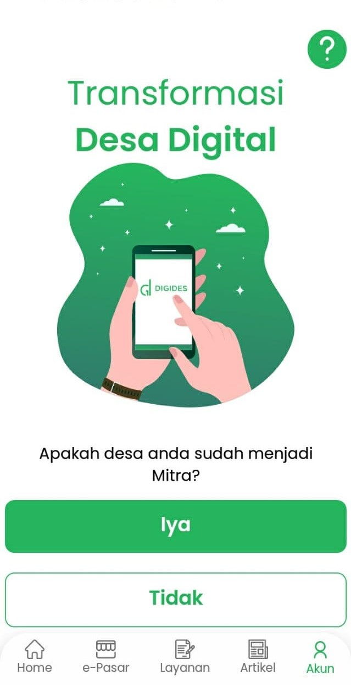

# Login Warga Biasa
Warga Biasa adalah warga yang bukan Mitra, dan hanya memiliki akses fitur yang terbatas.

1. Pada bagian Tab Akun pilih akan muncul halaman berikut, klik tombol "Tidak". 

2. Masukan username dan password, klik "Login". 

3. Jika halaman verifikasi OTP muncul, kode OTP akan dikirim melalui SMS/Whatsapp, masukan kode OTP yang diterima dan klik "Verifikasi". 

4. Jika nomor telepon yang dimasukan salah, nomor bisa diganti dengan klik "Ganti nomor telepon" lalu isikan nomor telepon yang ingin digunakan. 
