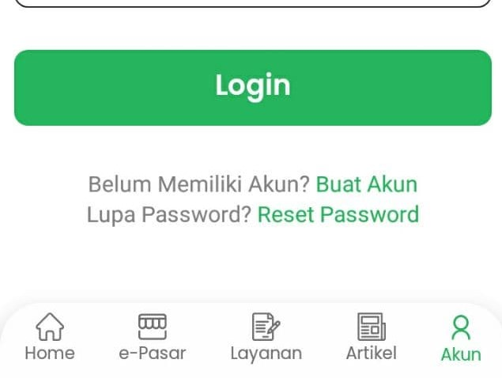
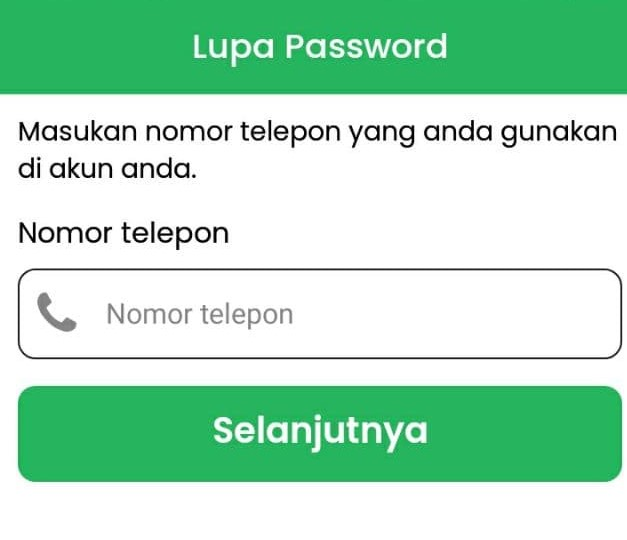
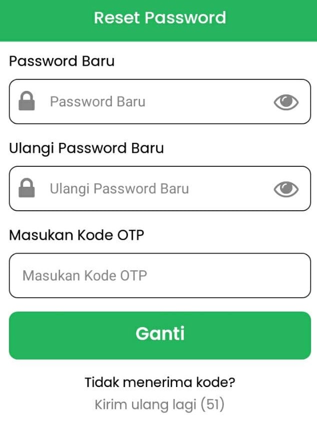

# Lupa kata sandi

Kata sandi merupakan hal penting untuk bisa _login_ ke akun Digides, Jika anda lupa kata sandi ikuti panduan di bawah ini.

1. Di bagian halaman login pilih “Reset Password”.

2. Setelah itu akan tampil halaman untuk mengisi nomor telepon, isi nomor telepon sesuai dengan yang terdaftar dengan akun anda, klik "Selanjutnya".

3. Kode OTP akan dikirim ke nomor telepon tersebut melalui SMS/Whatsapp.
4. Masukan kata sandi baru lalu ulang kata sandi baru dan masukan kode OTP yang diterima, klik "Ganti", jika belum menerima kode OTP klik "Kirim ulang lagi"

5. Setelah kata sandi berhasil dirubah, akan diarahkan kembali ke halaman _login_, silahkan login dengan kata sandi baru.
