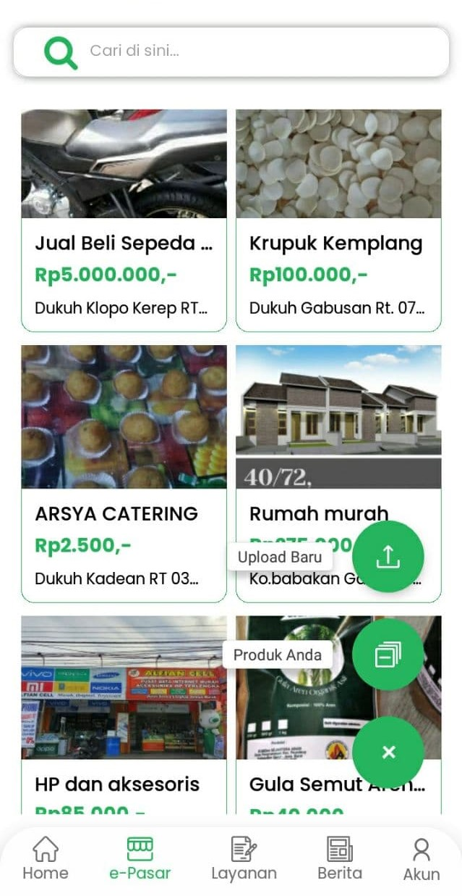
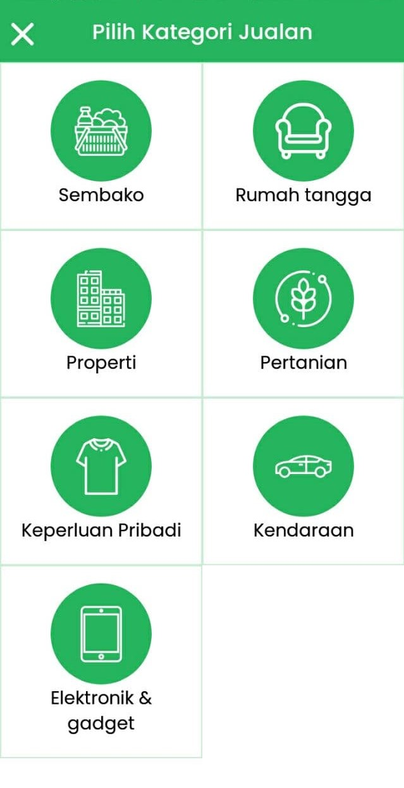
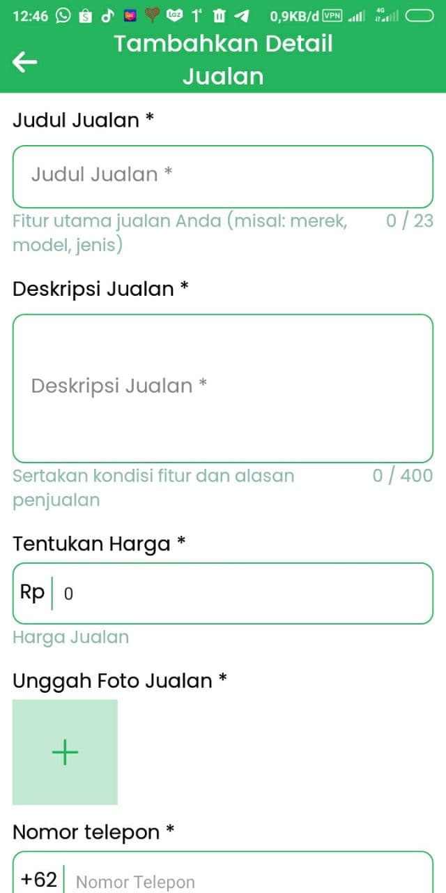
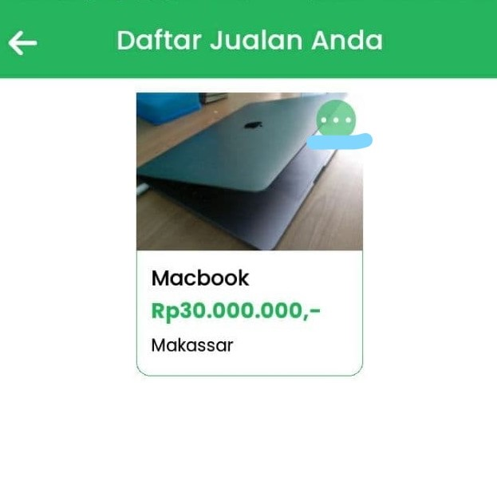
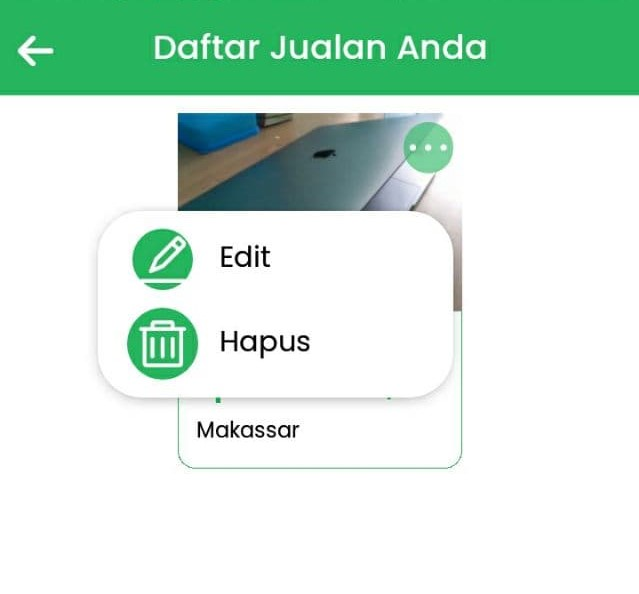
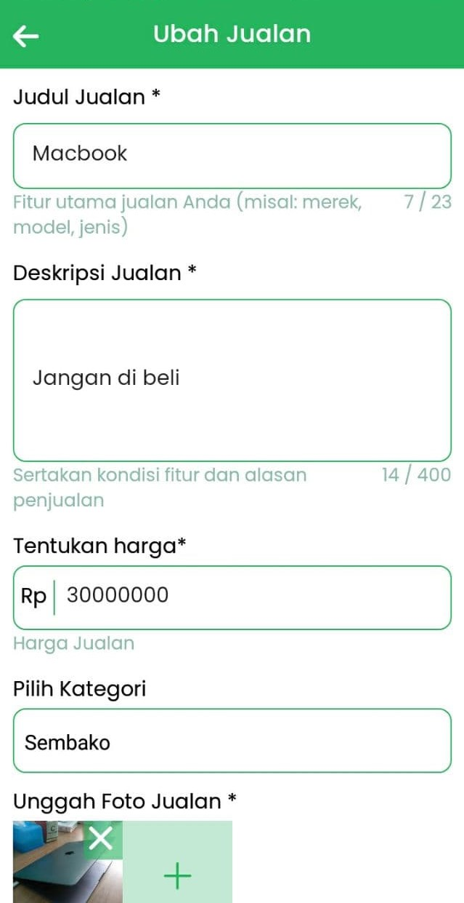
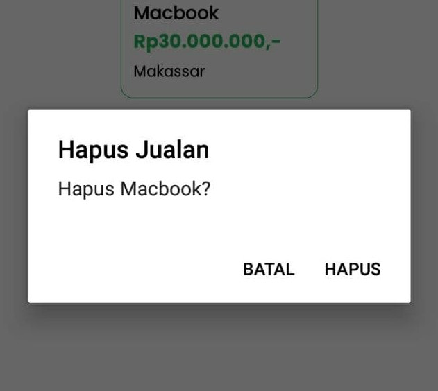

# e-Pasar

e-Pasar merupakan marketplace yang dapat digunakan oleh pengguna Digides.

## Upload Produk

1. Pada Tab e-Pasar, klik tombol "+" di kanan pojok bawah lalu klik tombol "Upload Baru". 

2. Pilih kategori produk yang ingin di upload. 

3. Isi form dengan baik dan benar, lalu klik "Kirim". 

 

## Edit Produk

1. Pada Tab e-Pasar, klik tombol "+" di kanan pojok bawah lalu klik tombol "Produk anda". 

2. Halaman yang berisi produk yang pernah diupload akan muncul, cari produk yang ingin di edit dan klik "..." pada pojok kanan gambar produk. 

3. Klik "Edit". 

4. Halaman form edit produk akan muncul, silahkan ubah sesuai yang di-ingingkan, lalu klik "Simpan" 

## Hapus Produk

1. Pada Tab e-Pasar, klik tombol "+" di kanan pojok bawah lalu klik tombol "Produk anda". 

2. Halaman yang berisi produk yang pernah diupload akan muncul, cari produk yang ingin di edit dan klik "..." pada pojok kanan gambar produk. 

3. Klik "Hapus". 

4. Akan muncul konfirmasi hapus, pilih "Hapus" untuk menghapus. 

