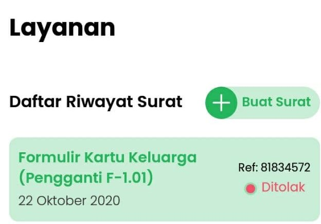
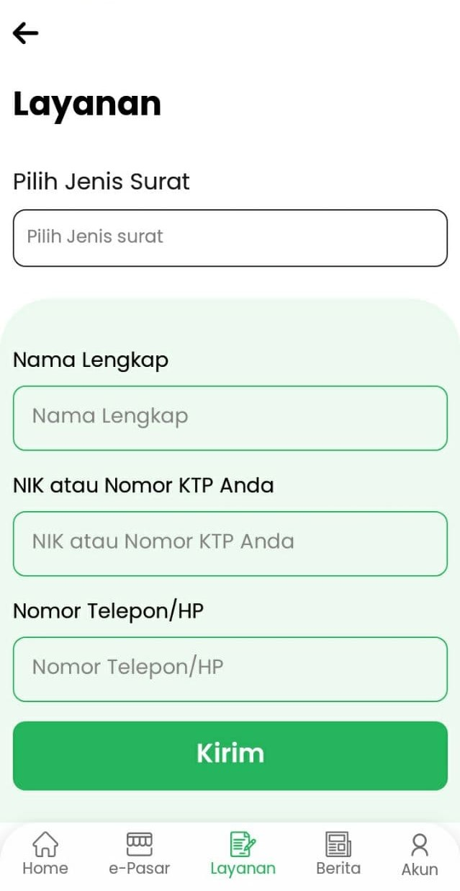
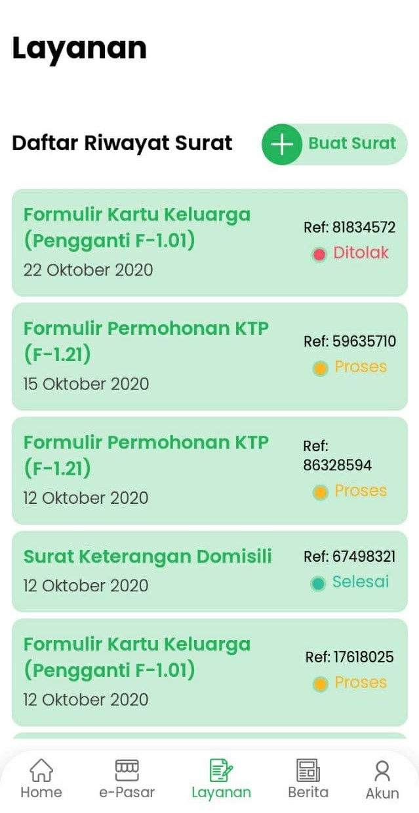

# Layanan Persuratan

Fitur ini memungkinkan Warga Desa Mitra untuk meminta pembuatan surat ke kantor desa secara Onlie.

## Buat Surat
1. Pada tab layanan klik "Buat surat"

2. Pilih surat yang ingin dibuat, dan isi semua isian dengan benar, lalu klik "kirim".

3. Setelah dikirim, tinggal menunggu staff desa membuat surat anda dan menghubungi anda.

## Status Surat
Pada bagian Tab Layanan akan tampil daftar permintaan surat beserta statusnya yang telah dibuat sebelumnya.

- **Terkirim** 
    Permintaan surat telah dikirim ke kantor desa dan menunggu ditindak lanjuti oleh staff desa.
- **Proses** 
    Permintaan surat telah diproses oleh staff.
- **Selesai** 
    Permintaan surat telah selesai dibuat, staff akan menghubungi kapan surat bisa diambil atau bisa lansung diambil di kantor desa.
- **Ditolak** 
    Permintaan surat ditolak dibuat, staff desa akan menghubungi untuk alasan penolakannya.

